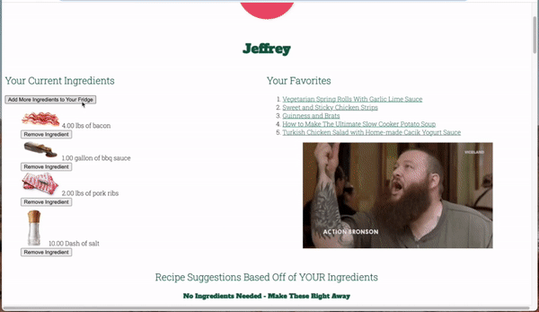
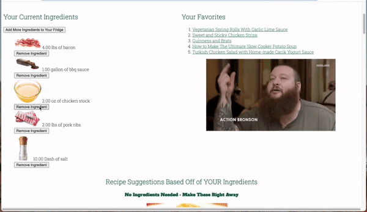
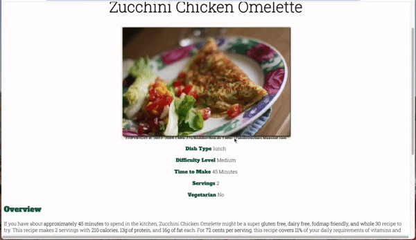
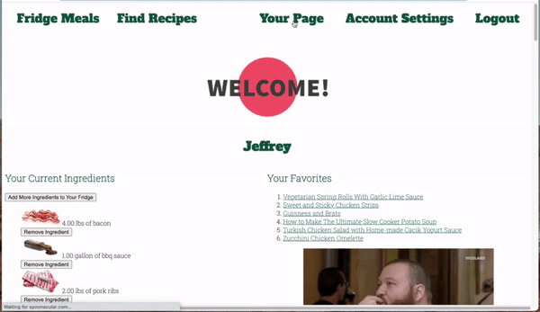
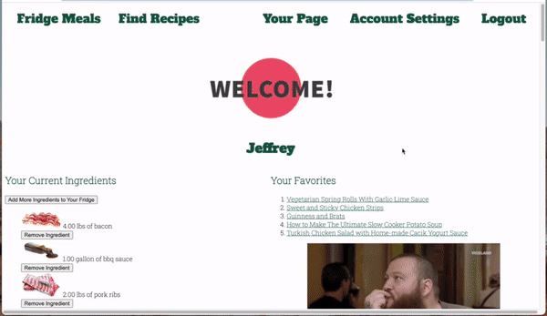
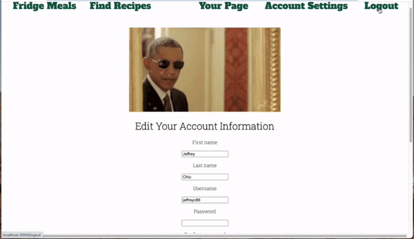

`Fridge Meals` is an app allowing users to discover recipes based on the ingredients they have available at home. 

Created in partnership with Flatiron School cohort-mate [Conor Murnane](https://github.com/cmur11).

## Demo

Watch the [Demo](https://www.loom.com/share/3f686e9cacc942d5926fe29d9e084c66)

## Technologies Used

`Fridge Meals` is built using `Ruby on Rails` and `SQLite`. Styling is done with all custom HTML and CSS. 

The app relies on ingredient and recipe information sourced from [Spoonacular](https://spoonacular.com/)'s API, as well as gifs to guide users through the application.

## Features

`Fridge Meals` allows users to discover recipes based on the ingredients they currently have available. Recipes suggestions will show the number of missing ingredients away a user is from completing the dish, as well as cooking and nutritional information.

### Signing Up / Logging In

Users are able to sign up and login. If any validations fail, errors are displayed back to the user. Upon a successful creation of an account or log in, the user is brought to their profile landing page.

On their landing page, a user will have access to their favorited recipes, their current ingredients, and recipe suggestions based on their ingredient inventory. Suggestions are categorized based on how many ingredients are missing from the dish.

### Updating Current Ingredients

Users are able to search for ingredients to their current inventory by name or filter by category. When they find the desired ingredient, the user specifies the quantity they have available to add it. Once added, the user's inventory and recipe suggestions will update accordingly.

Ingredients are removed by clicking the remove ingredient button beneath each ingredient. Once removed, the user's inventory and recipe suggestions will update accordingly.

### Finding Recipes

After clicking on the `Recipes` tab, the user is brought to the main recipes page where they'll find 10 randomly suggested recipes. They're also able to search for recipes by selecting through filters. If they don't have a preference for a specific filter, they may leave it blank.

After selecting their preferred filters and clicking search, the user is shown recipes that meet their preferences. Clicking on a recipe will bring the user to the recipe's page.

### Recipes

Each recipes will display cooking information along with an overview of the recipe. At the bottom of a recipe's page, a user may add or remove a recipe from their favorites.

### Favorites

Users are able to access their favortied recipes on their landing page by clicking on the recipe's link. If a recipe is added or removed from their favoites, it will be reflected this list.

### Account Settings

Users may update their account details and delete their account through `Account Settings`. There the same validations when updating account information.

### Logging Out

Clicking on `Logout` logs the user out and returns them back to the home page.

## License

The [MIT](https://choosealicense.com/licenses/mit/) License

Copyright (C) 2021 - [Jeffrey Chiu](https://github.com/jeffreyc86) and [Conor Murnane](https://github.com/cmur11)